# Side Project Forum

This is a forum built with React, SASS and CSS, Socket.io, Express, MongoDB. Data for demo is generated by python scripts in /forum/scripts folder.

I have deployed the website on [https://forum.htchenlisa.com/](https://forum.htchenlisa.com/). I have also set up CI/CD pipelines with Jenkins on my server. [I](https://github.com/owlhtchen) pair-programmed some parts of the project with [another classmate](https://github.com/shiinamiyuki) and had some teamwork experience.

## Check it on

Github: [https://github.com/owlhtchen/forum](https://github.com/owlhtchen/forum)

Deployed website: [https://forum.htchenlisa.com/](https://forum.htchenlisa.com/), you can login with email w@w.com and password w. I have registered accounts with email matching regex regex ([a-z]{1, 5})@[a-z].com and correspoding password [a-z] for demonstration purpose, e.g. you can login in with:

- email w@w.com and password: w
- email ww@w.com and password: w
- email www@w.com and password: w
- email wwww@w.com and password: w
- email wwwww@w.com and password: w

Substitube letter 'w' in the examples above with any letter from a to z should work as well.

The following pictures are gifs on github README.md. If possible, read the following content on [https://github.com/owlhtchen/forum/tree/master](https://github.com/owlhtchen/forum/tree/master) for better experience.

## Features

- Sign In

  Sign in with email and password. After signing in, you will be redirected to your profile page
  with your bio and timeline of post/comment.
  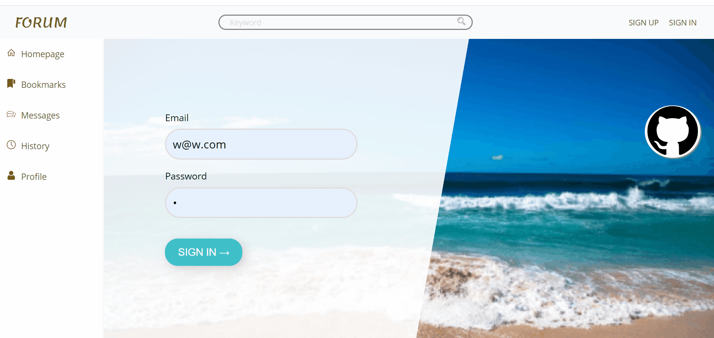
  
- Search for user and follow this user
  
  Follow user and see their timeline in 'For You' tab in homepage 
  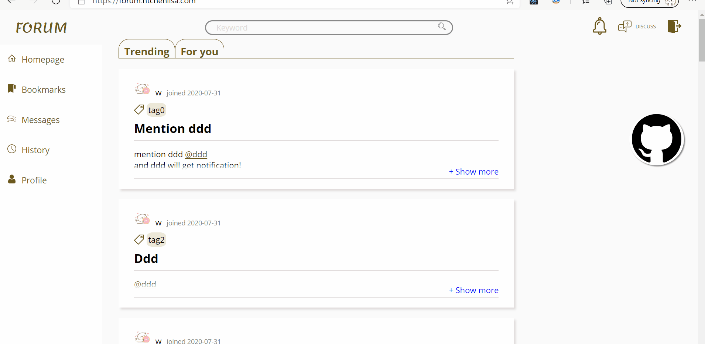

- Make a post

  Make a post in markdown editor. When you type @,
  a list of user with the username prefix you type will pop up. Click to choose the user you want to mention.
  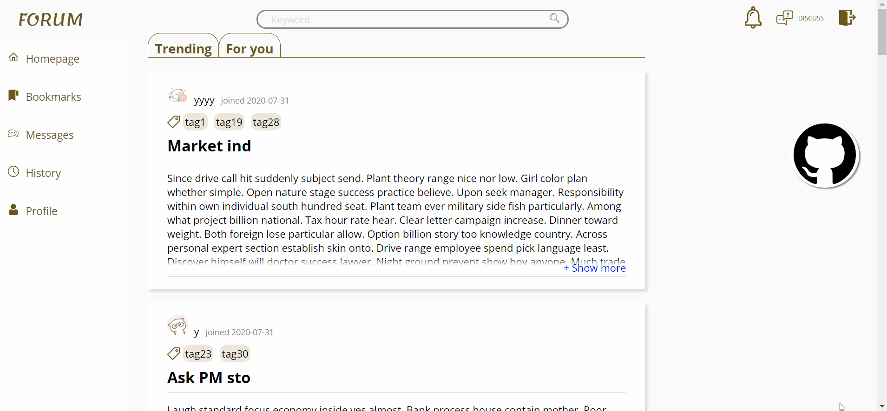

- Make nested comments

  You can make any level of nested comments. Look similar to reddit? Yes, it is!
  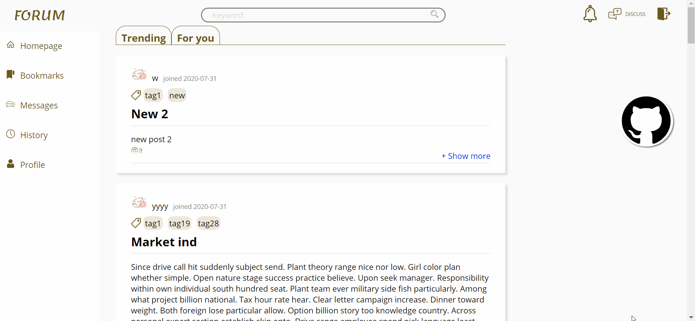

- Trie tree and search for a user in Messages

  When you type the username prefix, a list of users with that prefix will be shown for you to choose from. This is implemented with [Trie data structure](https://en.wikipedia.org/wiki/Trie)
  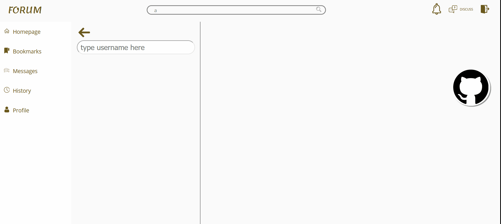

- Start a new chat (realtime)

  User w search for user d and starts a new chat.
  The conversation appears on the chat pages of user w and user d in real time. This is implemented using the [Socket.io](https://socket.io/) framework.
  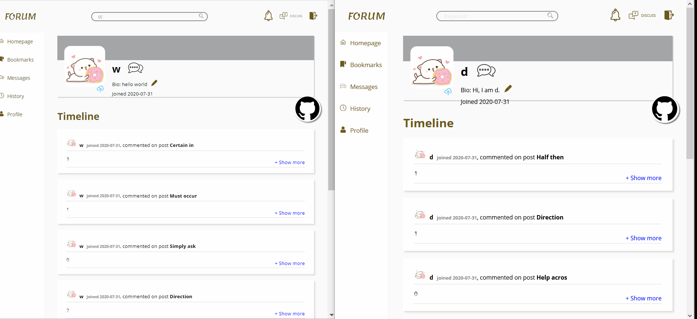

- Chat history is saved

  Message history between a and w is saved.
  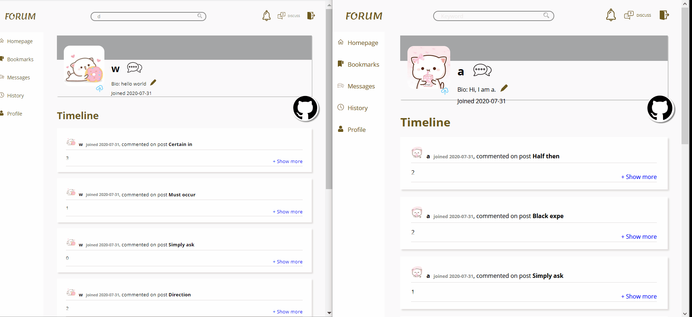

- Tag page

  Search for tag page, click on the tag and all posts with the same tag are shown.
  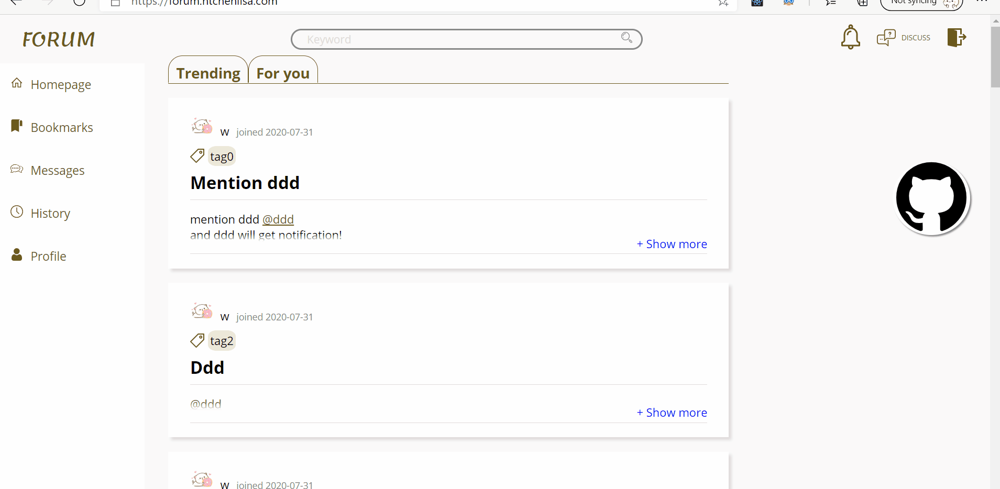

- Notification when someone starts following you
  User ddd receive a notification when user w starts following ddd.

  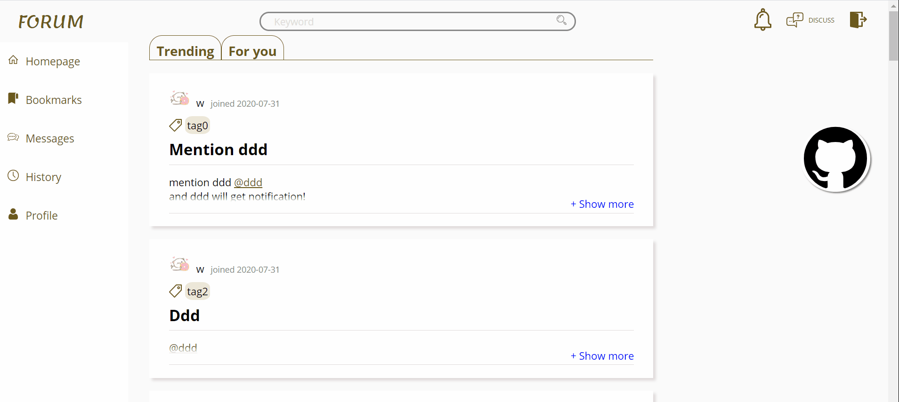

- Notification when someone @you in a post

  User w mentioned user ddd in a post and user ddd received notificaiton. Feels like twitter?
  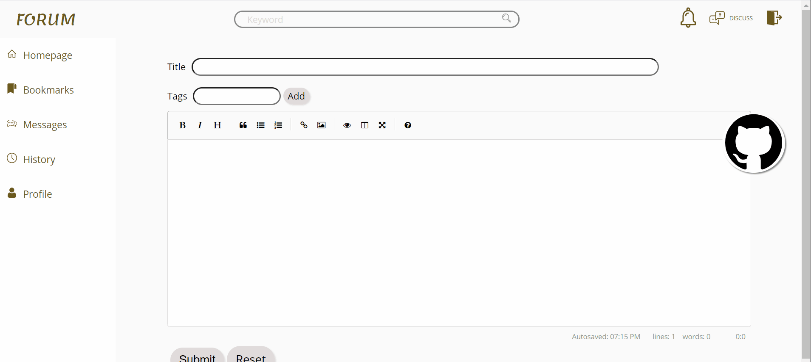

- Load more posts when scrolling down

  

- Upvote a post to make it rank higher

  Posts are ranked based on time when it's posted and number of upvotes. More recent posts and posts with more upvotes are ranked higher.
  

- Share post or nested comments

  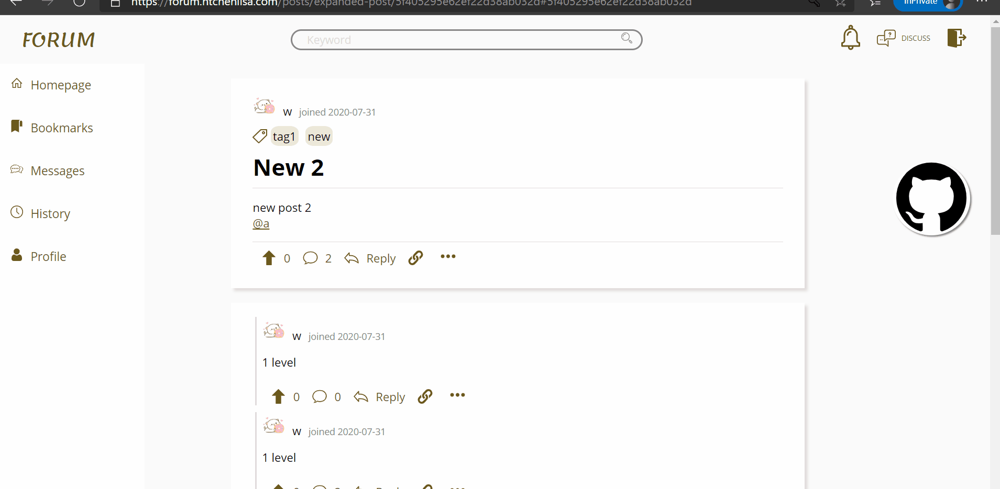

- Bookmark any post or nested comments

  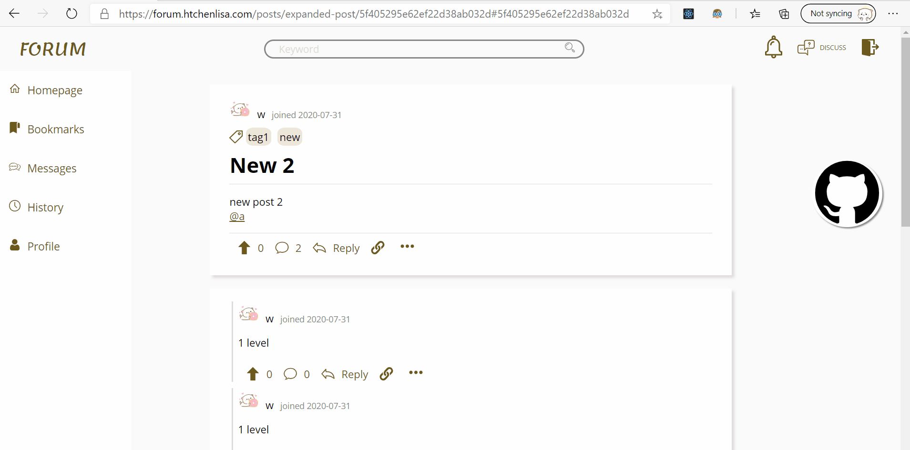

- Browse history

  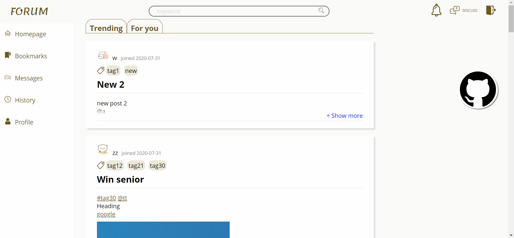

# Run on your own computer
Clone the repository, in the /forum folder, run npm start in terminal, and the website is at localhost:5000 by default.